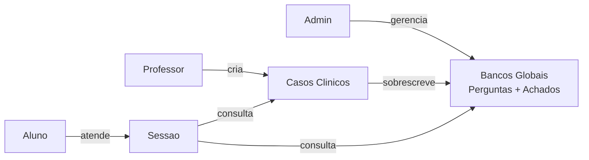
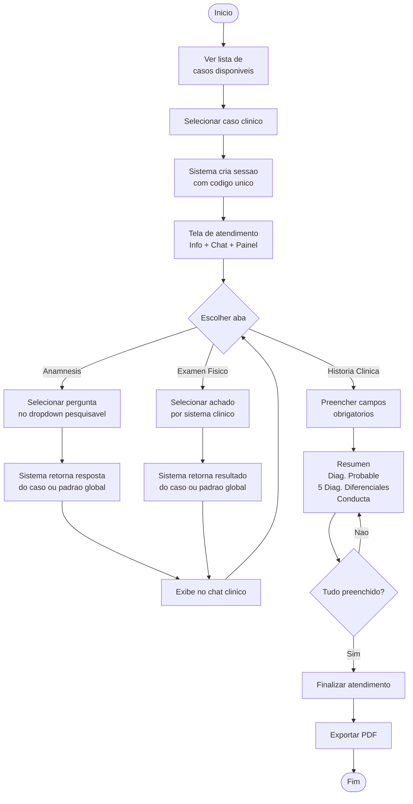
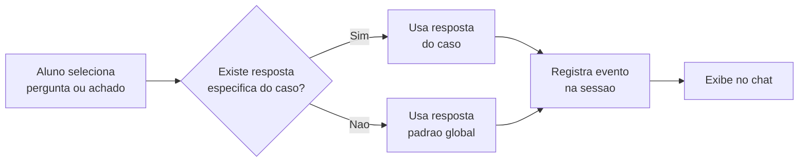
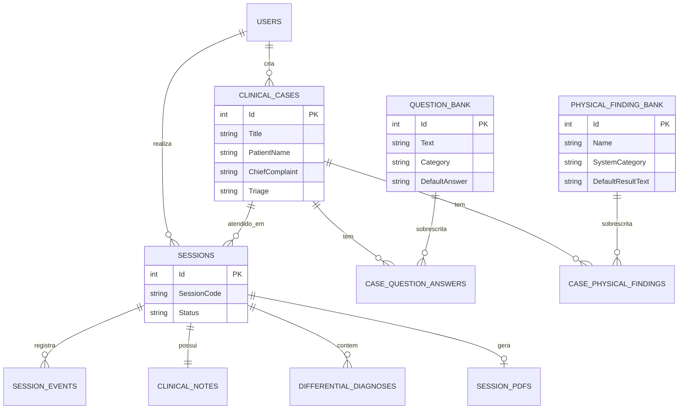
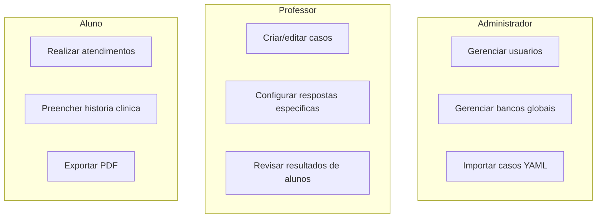

# ClinicaSim

Plataforma educacional para treinamento clínico de estudantes de medicina. Simula atendimentos com pacientes fictícios em ambiente controlado e determinístico.

---

## Stack

| Camada   | Tecnologia                     |
|----------|--------------------------------|
| Backend  | .NET 10 Web API + EF Core      |
| Frontend | Angular 21 (TypeScript, SCSS)  |
| Banco    | PostgreSQL (Supabase)          |

---

## Pre-requisitos

- [Node.js](https://nodejs.org/) v20.19+ ou v22+ ou v24+
- [npm](https://www.npmjs.com/) v10+
- [.NET SDK](https://dotnet.microsoft.com/download) v8+ ou v10+
- [PostgreSQL](https://www.postgresql.org/) (ou conta no [Supabase](https://supabase.com/))

---

## Configuracao do Projeto

### 1. Clonar o repositorio

```bash
git clone https://github.com/euthiagochaves/simuladorClinica.git
cd simuladorClinica
```

### 2. Configurar o Backend

```bash
cd backend
dotnet restore
```

Edite `backend/ClinicaSim.API/appsettings.json` e substitua a connection string com seus dados do Supabase:

```json
{
  "ConnectionStrings": {
    "DefaultConnection": "Host=SEU_HOST;Port=5432;Database=postgres;Username=postgres;Password=SUA_SENHA"
  }
}
```

Para rodar:

```bash
dotnet run --project ClinicaSim.API
# API disponivel em http://localhost:5000
```

### 3. Configurar o Frontend

```bash
cd frontend/clinica-sim
npm install
```

Para rodar:

```bash
npx ng serve
# App disponivel em http://localhost:4200
```

### 4. Rodar ambos simultaneamente

Abra dois terminais:

```bash
# Terminal 1 - Backend
cd backend && dotnet run --project ClinicaSim.API

# Terminal 2 - Frontend
cd frontend/clinica-sim && npx ng serve
```

---

## Estrutura de Pastas

```
simuladorClinica/
├── backend/
│   ├── ClinicaSim.sln
│   └── ClinicaSim.API/
│       ├── Controllers/         → endpoints REST
│       ├── Models/Entities/     → entidades do EF Core
│       ├── Data/                → DbContext
│       ├── Services/            → logica de negocio
│       ├── DTOs/                → request/response objects
│       └── appsettings.json     → configuracoes
├── frontend/
│   └── clinica-sim/             → Angular SPA
│       └── src/app/             → componentes e servicos
├── docs/
│   └── instructions/            → documentacao detalhada (7 arquivos)
├── INSTRUCTIONS.md              → indice da documentacao
└── .gitignore
```

---

## Como Funciona

### Fluxo Geral



### Fluxo do Atendimento (Aluno)



### Logica de Resolucao de Respostas



> **Regra central:** O banco global representa um paciente saudavel. Cada caso clinico sobrescreve apenas o que e patologico. Se nao ha sobrescrita, o sistema usa a resposta padrao.

### Modelo de Dados



### Perfis de Usuario



---

## Documentacao Completa

Documentacao detalhada em arquivos separados dentro de `docs/instructions/`:

| Arquivo | Conteudo |
|---------|----------|
| [01 - Visao Geral](docs/instructions/01-visao-geral.md) | Objetivo, perfis de usuario, principios |
| [02 - Stack e Estrutura](docs/instructions/02-stack-e-estrutura.md) | Tecnologias, pastas, como rodar |
| [03 - Regras de Negocio](docs/instructions/03-regras-de-negocio.md) | Bancos globais, sobrescrita, sessao, fluxos |
| [04 - Modelo de Dados](docs/instructions/04-modelo-de-dados.md) | 16 tabelas, campos, relacionamentos |
| [05 - Interface UI](docs/instructions/05-interface-ui.md) | Layout, abas, chat clinico, idioma espanhol |
| [06 - Convencoes de Codigo](docs/instructions/06-convencoes-de-codigo.md) | Naming, padroes backend/frontend |
| [07 - Restricoes do MVP](docs/instructions/07-restricoes-mvp.md) | O que faz e o que NAO faz parte do MVP |

---

## Licenca

Projeto educacional — uso interno.

